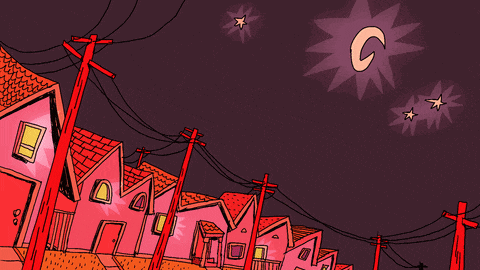

<table style="border-collapse: collapse;">
<tr>
<td style="border: none; padding: 0;""> 

```yaml
name: Lia Banuta
location: eindhoven (the netherlands)
status: 3rd year bcs student @ tue
studying: computer science & engineering

tags: #DevOps (god level)

fucking_around_with:
  - llms and ai stuff
  - machine learning sometimes  
  - neural networks *coming soon*
  - kaggle competitions (love the grind)

things_i_actually_know:
  - coding (decently)
  - 3d modelling (blender warrior)
  - making computers do stuff

when_not_coding:
  - biking (preferably not on concrete)
  - climbing stuff (rocks, walls, whatever)
  - drawing random things
  - i just like doing stuff
```

</td>
<td style="border: none; padding: 0;">



</td>
</tr>
</table>
<!--START_SECTION:waka-->
📊 **This Week I Spent My Time On** 

```text
💬 Programming Languages: 
No Activity Tracked This Week

🐱‍💻 Projects: 
No Activity Tracked This Week

💻 Operating System: 
No Activity Tracked This Week
```


 Last Updated on 22/09/2025 13:13:08 UTC
<!--END_SECTION:waka-->
